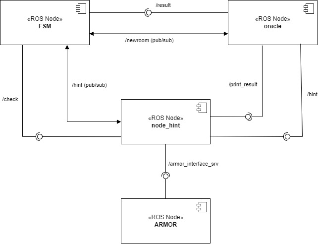
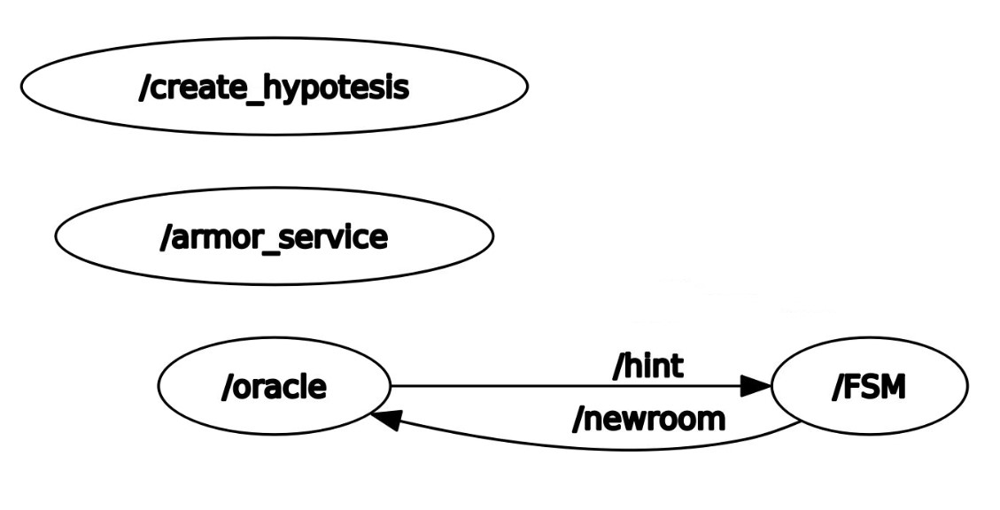
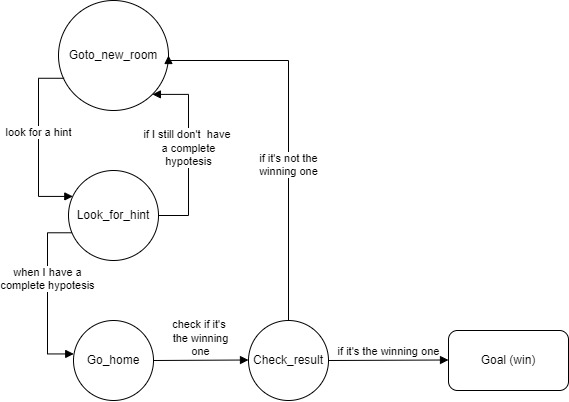
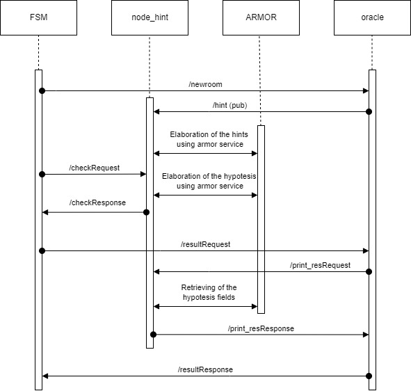
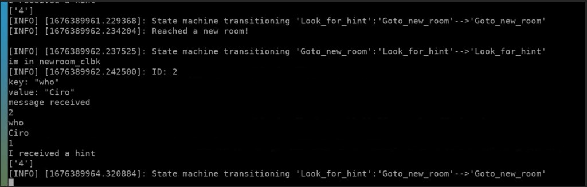
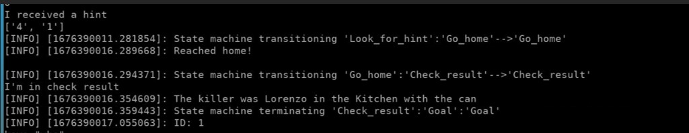

# Experimental Robotics Laboratory
This is the repository for the first assignment of he experimental robotics course of Unige.

## Description of the repository
In the repository it's possible to find:
* *launch* folder: contains the launch file;
* *msg* folder: contains the structure of the ErlOracle messagge;
* *scripts* folder: contains the three nodes of the assignment 
* *srv* folder: contains the structure of the services used in the assignment.

## Software Architecture
We can see in the image below the component diagram of the software:



* **FSM**: The `FSM` node is the "administrator" of the whole application: it's the node that implements the state machine that rules when the other nodes have to be called. It consists of 4 different states, that will be seen more in detail later on;
* **oracle**: The `oracle` node implements the rule of the oracle. Firstly, it receives, from the fsm, a notice when the robot arrives in a new room so it can give a hint. Secondly, it has also the rule to notify if a complete and consistent hypotesis is the winning one or not;
* **node_hint**: Also the `node_hint` node is very important; indeed it manages everything about the hints received: it loads the ontology and keeps it updated; it check if the hypotesis (that comprehends a 'what', a 'where' and a 'who' field belonging to the same ID) is complete and consistent; sends to the oracle the possible solution. All of this is possible thanks to the armor node;
* **ARMOR**: The `ARMOR` node is the one that "answers" to all the requests that comes from the node_hint about the ontology and management of the hypotesis.

In the image is also possible to see which services/topics are used to communicate between the nodes (the lollipop is used for the services while the double arrow is used for the topics of the publishers/subscribers).

About the nodes, it is been also reported the rqt_graph in which are seen only the topics of he publishers/subscribers:



### State diagram
In the following image is reported the state diagram, that is the description of the connections between the states of the fsm:



The robot starts in the *Goto_new_room* state, that in our application is basically a sleep (it should simulates the time the robot needs to change the room); then we always go to the *Look_for_hint* states where we receive a hint from the oracle and, if it has enough hints to make a complete hypotesis, it goes home, otherwise it returns to the goto_new_rom state; if the hypotesis is complete and consistent we want to check if it's the winning one, so we return home thanks to the *Go_home* state, that is again a simulation of the movement of returning home (implemented by a sleep); finally, in *Check_result* we confirms if the hypotesis is the winning one and if it is the goal is reached and we can exit the state machine, otherwise we return to goto_new_room to look for other hints.

### Temporal diagram
In the following image is represented the temporal diagram, of the software:



It shows in a explicit way the temporal connections of the nodes: we can see that everything starts at the FSM node and ends there. The temporal passagges (when the services/topics are called) are to be read from the top to bottom of the diagram (the upper one is the first step, the lower one is the last).

### Services
The custom services used in the software are the following:

* *hint*: the service used to pass all the fields of an hint, when requested. The response is a boolean, True if the hint is ok or False if it's malformed:  
```
int32 ID
string key
string value
---
bool check
```

* *correct_hyp*: the service used to check if there is at least a complete and consistent hypotesis. The response is a string of all the IDs of the hypotesis of this type:
```
bool t
---
string hypotesis
```

* *result*: the service used to request/send the winning hypotesis. The request is the ID while the response are the field of the hypotesis:
```
int32 ID
---
bool win
string who
string where
string what
```

### Messages
The only message used in the software is the *ErlOracle*, that contains all the fields of a generic hint:
```
int32 ID
string key
string value
```

### Smach State Machine
The implementation of the finite state machine has been done thanks to the `smach` library, in which we have just to write the code to be executed at each state. There is also a useful tool that is `smach_viewer` that allows us to visualize the structure of the fsm:


The image, as expected, is the same as the state diagram.
It is possible, in the terminal, to see the following screenshots:



These are the first states of the fsm where we can see the change of state from *look_for_hint* to *goto_new_room* and vice versa. In the screen we can see that the hint "ID: 2" "who" "Ciro" has been received and, since we haven't received enough hint for the ID: 2, we go to a new room.

In the second image is possible to see the final states of the fsm:



We have received enough hints to make a hypotesis for the ID: 1, so we *go_home* and *check_result*. We were lucky and the ID: 1 was the correct answer, so we can also see the final print of the culprit.

## Running the code
To run the code we actually just have to clone this branch of the repository in our catkin_ws, run the `catkin_make`, go to the scripts folder and digit:
```
chmod +x script1_name.py script2_name.py ...
```
for every .py file.

Then we just write in the terminal:
```
roslaunch exprolab_ass1 assignment.launch
```
to launch all the nodes.

## Working Hypotesis and Environment
The environment in which the robot moves is immaginary, so the robot's actions aren't real but just simulated. However, the node created are easily adaptable to a Gazebo simulation (for example) with the addition of some codes in the finite state machine.

### System's Features
The system is very modular, each node handles a different task: `oracle` gives the hints, `create_hypotesis` manages all the hint's aspects and `fsm` manage the robot's actions.

### System's Limitations 
The hints managed by the robot are complete (it can manage also malformed or empty hints, because I already know that it would be an aspect in the next assignments) but the ontology is not readable when updated and the terminal output is difficult to read if someone is not familiar with the smach output.

### Possible Techical Improvements
It would be nice to test this branch with a simulation environment instead of using simulated actions and it could be useful to have a more user friendly interface to manage the output of the various nodes. 