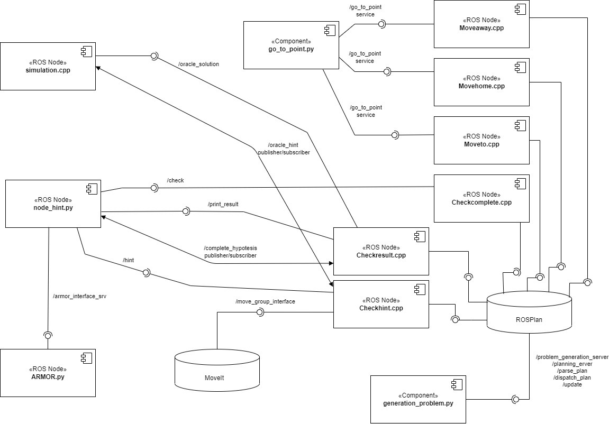
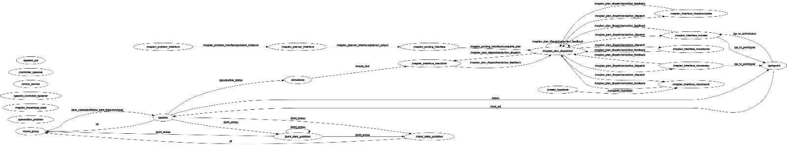
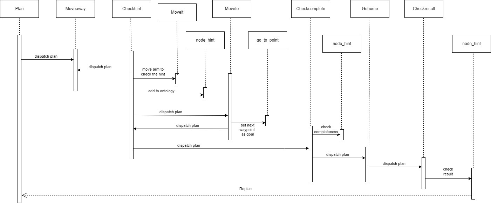
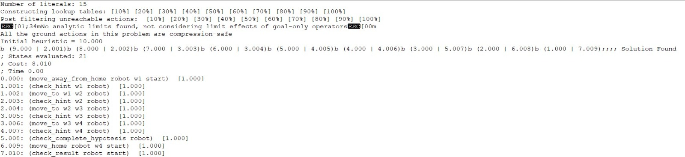
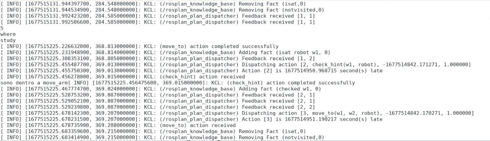
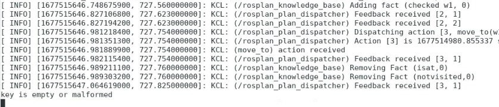
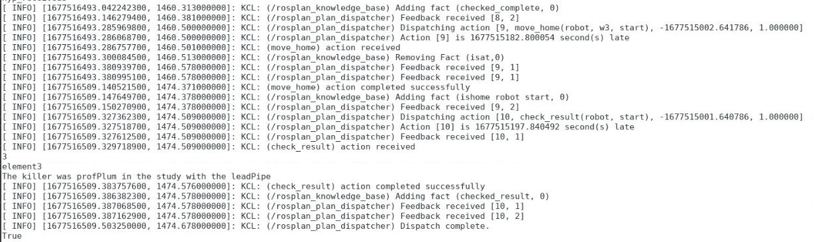

# Experimental Robotics Laboratory
This is the repository for the second assignment of the experimental robotics course of Unige.

## Description of the repository
In the repository it's possible to find:
* *action* folder: contains the structure of the Moving action;
* *common* folder: contains the plan and the problem generated by ROSplan;
* *config* folder: contains the rviz simulation file;
* *include* folder: contains the header of the ActionInterface;
* *launch* folder: contains the launch files;
* *msg* folder: contains the structure of the ErlOracle messagge;
* *scripts* folder: contains scripts of three nodes of the assignment; 
* *src* folder: contains the cpp codes associated to the actions and the simulation;
* *srv* folder: contains the structure of the services used in the assignment;
* *urdf* folder: contains the urdf model of the robot used;
* *world* folder: contains the world file used for the simulation environment;
* *domain and problem*: pddl files used by ROSplan;
* *script.sh*: shell script.

## Software Architecture
We can see in the image below the component diagram of the software:



* **node_hint**: The `node_hint` node implements the node that receives the hint from the oracle and saves it in the ontology. The armor node will tell us if the hint is malformed or valid. It also implements the checking of the completeness and consistency of the hypothesis. Eventually retrieves the field of an hypothesis from the ontology, given an ID;
* **generation_problem**: The `generation_problem` node implements the various calls to ROSplan to generate the plan run by the robot. It requests feedback from the plan and produces new plans until the goal is reached. It also updates the knowedge base;
* **go_to_point**: The `go_to_point` node controls the behavior of the robot according to the go_to_point behavior via an action server. A FSM is used to model the behavior every time a new goal pose is received: firstly the robot alight its position with the goal's one, then it goes straight to the goal position, it aligns with the goal orientation and then the goal pose is reached;
* **Moveto**: The `Moveto` node implements the 'move_to' pddl action to a waypoint. This is possible thanks to the go_to_point node;
* **Moveaway**: The `Moveaway` node implements the 'move_away_from_home' pddl action to move the robot from home to the waypoint chosen by the planner. This is possible thanks to the go_to_point node;
* **Movehome**: The `Movehome` node implements the 'move_home' pddl action to return to the home waypoint. This is possible thanks to the go_to_point node;
* **Checkhint**: The `Checkhint` node implements the 'check_hint' pddl action to move the robotic arm to look for the hint. It uses the 'moveit' library to do so;
* **Checkcomplete**: The `Checkcomplete` node implements the 'check_complete_hypotesis' pddl action to check if the passed hypotesis is complete and consistent;
* **Checkresult**: The `Checkresult` node implements the 'check_result' pddl action to check if the complete hypotesis is the correct one and, in that case, print the solution.
* **ARMOR**: The `ARMOR` node is the one that "answers" to all the requests that comes from the node_hint about the ontology and management of the hypotesis.

In the image is also possible to see which services/topics are used to communicate between the nodes (the lollipop is used for the services while the double arrow is used for the topics of the publishers/subscribers).

About the nodes, it is been also reported the rqt_graph in which are seen only the topics of the publishers/subscribers:



### Temporal diagram
In the following image is represented the temporal diagram, of the software:



It shows in a explicit way the temporal connections of the nodes: we can see that the the structure follows linearly the execution of the plan. There are also the `Moveit` and `Go_to_point` nodes that have been reported to clarify when they are called and used. The create hypotesis and simulation nodes are called a lot of times so, to not make the diagram really heavy to read, I didn't inserted them (still in the *component_diagram* we can see when the services are called). 
The temporal passagges are to be read from the top to bottom of the diagram (the upper one is the first step, the lower one is the last).

### Actions
The only action used in the software is *Moving*, that contains all the information about the goal position and the robot position:
```
geometry_msgs/PoseStamped target_pose
---
geometry_msgs/Pose actual_pose
---
string stat
```
The request is of the type geometry_msgs and the response is composed by a geometry_msgs and a string.

### Services
The custom services used in the software are the following:

* *hint*: the service used to pass all the fields of an hint, when requested. The response is a boolean, True if the hint is ok or False if it's malformed:  
```
int32 ID
string key
string value
---
bool check
```

* *correct_hyp*: the service used to check if there is at least a complete and consistent hypotesis. The response is a string of all the IDs of the hypotesis of this type:
```
bool t
---
string hypotesis
```

* *print_res*: the service used to request/send the fields of the winning hypotesis. The request is the ID while the response are the field of the hypotesis:
```
int32 ID
---
string who
string where
string what
```

* *Oracle*: the service used to request the ID of the winning hypotesis:
```
---
int32 ID
```

* *Position*: the service used to set the postion to reach:
```
float32 x
float32 y
float32 theta
---
bool ok
```

### Messages
The only message used in the software is the *ErlOracle*, that contains all the fields of a generic hint:
```
int32 ID
string key
string value
```

### PDDL 
Relative to the planning part, there are the following files:
* `domain.pddl`: the domain file used by the planner where are defined all the predicates and actions;
* `problem.pddl`: the problem file used by the planner to read the objects to use in the plan and the goal state we want to achieve;
* `new_problem`: in the folder *common*, the problem generated by ROSplan (same as the file afore mentioned);
* `plan`: in the folder *common*, the plan we want to follow (id something goes wrong, we have to replan). This file can change during the execution of the plan.

The plan dispatched has a form of the type:



We can see that there are instantiated all the objects used in the plan:
* `w1`, `w2`, `w3`, `w4`: the waypoints, that corresponds to  the coordinates specified in *Moveto*;
* `start`: the coordinates of *home*;
* `robot`: the agent used in the plan.

### Simulation
In this section are reported some screenshots of the terminal and a brief video of the simulation with some interesting aspects.
First of all, we can encounter different kind of hints:
* good hint:

    

    In this specific case we received an hint corresponding to the ID 5 (where, study). We can see also the output of the ROSplan, where we can see a `check_hint` action dispatched and executed (so w1 is checked) and the dispatching of the next action `move_to`;

* malformed hint:

    

    In this case, it will appear on the terminal that "key is empty or malformed" so one of the fields of the hint are empty or equal to "-1";

* end game with the print:

    

    In the image we can see the dispatching and execution of the `move_home` and `check_result` actions, with the printing of the winner (corresponding to ID 3).


I report also a video that I will briefly explain to make clear what I would like to show.
The video is split in two parts:
* first part: I want to show, in the gazebo simulation how the robot approaches a waypoint and how it moves the arm in a lower position (thanks to `Moveit`). The video is sped up because it's a slow movement;
* second part: not sped up because I just want to show how the "real" simulation environment (we can look at it in the Rviz tab) is. There are 4 green spheres, that can be high (height od 1.25) or low (height of 0.75), that contains an hint: the robot has to go through it to catch the hint. The spheres are near the waypoint that the robot has to reach.

[video](https://www.youtube.com/watch?v=e6bZsWgrhO4)
