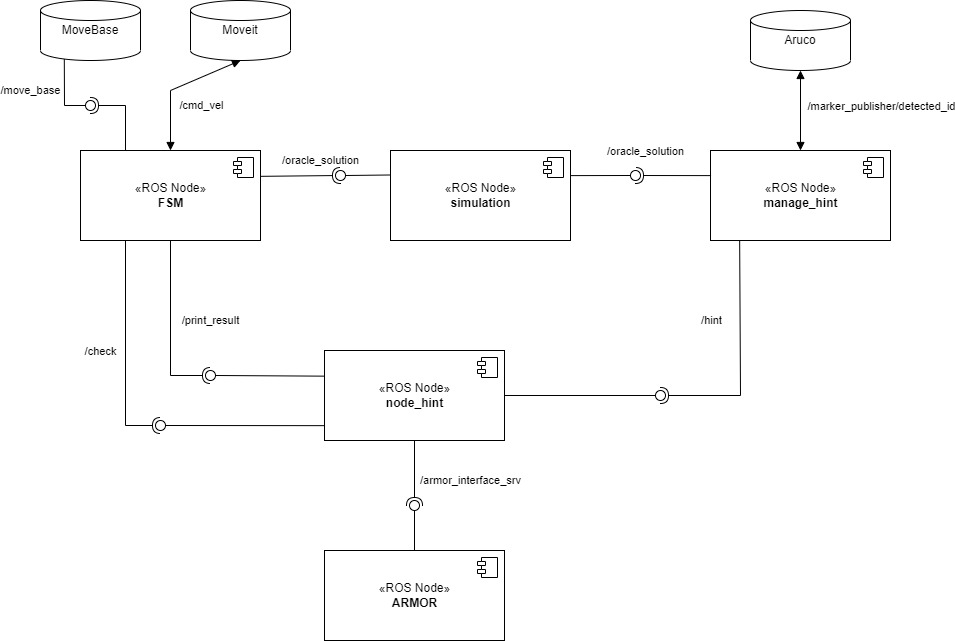
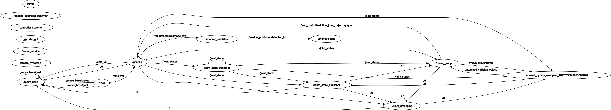
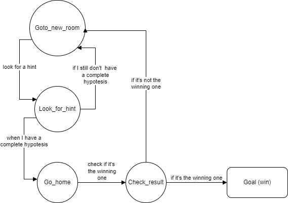
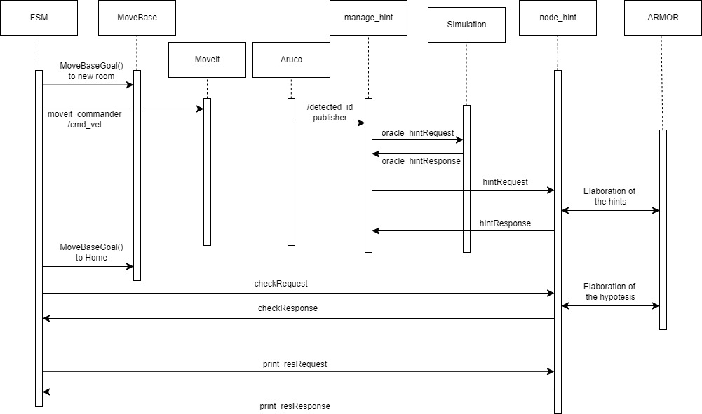
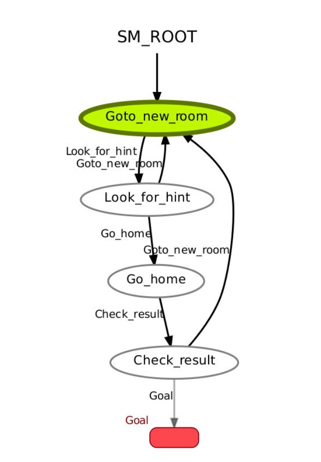
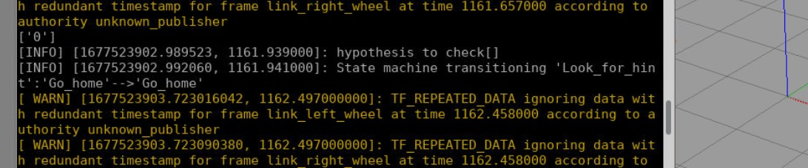

# Experimental Robotics Laboratory
This is the repository for the third assignment of the experimental robotics course of Unige.

## Description of the repository
In the repository it's possible to find:
* *launch* folder: contains the launch files;
* *models* folder: contains the models for the markers;
* *msg* folder: contains the structure of the ErlOracle messagge;
* *param* folder: contains some .yaml files with some parameters for the robot and other aspects;
* *scripts* folder: contains three .py nodes for the assignment;
* *src* folder: contains a cpp node for the assignment;
* *srv* folder: contains the structure of the services used in the assignment;
* *urdf* folder: contains the structure of the robot used in the simulation;
* *worlds* folder: contains the folder with the world for the simulation.

## Software Architecture
We can see in the image below the component diagram of the software:



* **FSM**: The `FSM` node is the "administrator" of the whole application: it's the node that implements the state machine that rules when the other nodes have to be called. It consists of 4 different states, that will be seen more in detail later on;
* **simulation**: The `simulation` node has the role to give information about the hints associated to the markers (it gived the fields of the hint as an ErlOracle.msg) to manage_hint and the winning ID (oracle_solution) to node_hint;
* **manage_hint**: The `manage_hint` node implements the behaviour to retrieve all the hints. Firstly, it receives the hints published by the Aruco node; then requests the complete hint to the simulation node; at last makes an hintRequest to node_hint to manage all the interactions with ARMOR;
* **node_hint**: Also the `node_hint` node is very important; indeed it manages everything about the hints received: it loads the ontology and keeps it updated; it check if the hypotesis (that comprehends a 'what', a 'where' and a 'who' field belonging to the same ID) is complete and consistent; sends to the FSM all the checks needed and the field of the winning ID (when we have enoguh hints about that). All of this is possible thanks to the armor node;
* **ARMOR**: The `ARMOR` node is the one that "answers" to all the requests that comes from the node_hint about the ontology and management of the hypotesis.

In the image is also possible to see which services/topics are used to communicate between the nodes (the lollipop is used for the services while the double arrow is used for the topics of the publishers/subscribers).

About the nodes, it is been also reported the rqt_graph in which are seen only the topics of he publishers/subscribers:



### State diagram
In the following image is reported the state diagram, that is the description of the connections between the states of the fsm:



* The robot starts in the *Goto_new_room* state, that in our application is possible thanks to the action MoveBaseGoal, where we set our destination and it manages all the velocities to reach that point;
* Then we always go to the *Look_for_hint* state where we move the robotic arm (thanks to the moveit libraries) and the robot (publish an angular velocity around z via /cmd_vel to move it in the clockwise and counter-clockwise direction) and check if there is any marker that contains an hint;
* If we have enough hints to make a complete and consistent hypotesis, it goes home, otherwise it returns to the goto_new_rom state;
* If the hypotesis is complete and consistent we want to check if it's the winning one, so we return home thanks to the *Go_home* state (same as the goto_new_room);
* Finally, in *Check_result*, we confirms if the hypotesis is the winning one and if it is the goal is reached and we can exit the state machine, otherwise we return to goto_new_room to look for other hints.

### Temporal diagram
In the following image is represented the temporal diagram, of the software:



It shows in a explicit way the temporal connections of the nodes: we can see that everything starts at the FSM node and ends there. The temporal passagges (when the services/topics are called) are to be read from the top to bottom of the diagram (the upper one is the first step, the lower one is the last).

### Services
The custom services used in the software are the following:

* *hint*: the service used to pass all the fields of an hint, when requested. The response is a boolean, True if the hint is ok or False if it's malformed:  
```
int32 ID
string key
string value
---
bool check
```

* *correct_hyp*: the service used to check if there is at least a complete and consistent hypotesis. The response is a string of all the IDs of the hypotesis of this type:
```
bool t
---
string hypotesis
```

* *print_res*: service used to send all the fields of the winning hypotesis when requested:
```
int32 ID
---
string who
string what
string where
```

* *Marker*: service that receives a marker_id as a request and return all the fields associated to that id (as a ErlOracle.msg):
```
int32 markerId
---
exprolab_ass3/ErlOracle oracle_hint
```

* *Oracle*: service that sends the winning ID when requested:
```
---
int32 ID
```

### Messages
The only message used in the software is the *ErlOracle*, that contains all the fields of a generic hint:
```
int32 ID
string key
string value
```

### Smach State Machine
The implementation of the finite state machine has been done thanks to the `smach` library, in which we have just to write the code to be executed at each state. There is also a useful tool that is `smach_viewer` that allows us to visualize the structure of the fsm:



The image, as expected, is the same as the state diagram.

It is possible, in the terminal, to see the following screenshots relative to the fsm:



In this image I want to show that, when there is a hypotesis complete to check, the terminal change state from *look_for_hint* to *go_home*;

In the second image is possible to see the final result (after a checking of the winning id, to be sure that it's the correct hypotesis), where the state change from *go_home* to *check_result* and eventually (if the hypotesis is not correct, it would just return to *goto_new_room*) to *Goal* that is the exit of the state machine:


The ID: 0 was the correct answer, so we can also see the final print of the culprit.

I also put a brief video that shows the highlights of the simulation that I will explain before the vision:
* *first part*: in this section we can see the start of the simulation where the robots go to the first room (I also show some of the hints that the robot receives while moving);
* *second part*: in this section I want to show how the robot moves during the *look_for_hint* state;
* *third part*: I want to show how it changes room again. This procedure will last until the robot has enough hints to make a complete hypotesis, then it will go home to check the result. 

[click to the video](https://www.youtube.com/watch?v=jnmkNVaa2HE)


## Running the code
To run the code we have to follows few steps:
* *first*: clone the Aruco package from the github repository of the professor [Carmine Recchiuto](https://github.com/CarmineD8) [link_to_Aruco](https://github.com/CarmineD8/aruco_ros.git) in the src folder of the catkin workspace with the command:

```
git clone https://github.com/CarmineD8/aruco_ros.git
```

* *second*: clone this repositiory in the src folder of the catkin workspace:
```
git clone https://github.com/LorenzoMorocutti/exprolab.git
cd exprolab
git checkout assignment3
```
and move the exprolab_ass3 folder in the src folder;
* *third*: copy the content of the folder `models` in the folder `.gazebo` in the root;
* *fourth*: go to the scripts folder and make the .py files executable with the command:
```
chmod +x script1_name.py script2_name.py ...
```
for every .py file;
* *fifth*: go to the catkin workspace folder and run `catkin_make`;


Then we have to open three tabs in the terminal:
* *first tab*: digit
```
roslaunch exprolab_ass3 simulation.launch
```
* *second tab*: digit
```
rosrun exprolab_ass3 FSM.py
```
* *third tab*: digit
```
rosrun exprolab_ass3 manage_hint.py
```
to launch all the nodes.

I chose to manage all the launching like this because (personal opinion) it's easier to monitor the changes of the state machine and the hint received (we can look at them in the manage_hint tab).

## Working Hypotesis and Environment
The environment in which the robot moves is a Gazebo simulation. As the previous assignment, the hints are given by the author professor [Carmine Recchiutto](http://github.com/CarmineD8), so I just had to deal with them (by reading the markers and then retrieving the hint). All about the hints remains valid from the first two assignments.

### System's Features
The architecture is definitely modular: each node execute small task, so we can change them to adapt the software to new implementations (basically I reused a lot of code from the first assignment, the manage of the hints by node_hint is the exact same). The system is thus very robust. 

### System's Limitations 
The hints managed by the robot aren't modifiable (they are, but the goal of the assignment is to manage hints not written by the user) but the ontology is not readable when updated and the terminal output is difficult to read if someone is not familiar with the outputs (in the state machine terminal there are information about moveit that cannot be canceled, so we have to look carefully to the useful information). The simulation is very slow so it's very difficult to debug the code (there are definitely some shortcuts, for example, from the terminal we can publish hints on the topic /oracle_hint to give the robot a complete hypotesis directly, to test the check_complete and check_result).
Differently from the last assignment, I tried this code on other PCs and it seems like it works on every device (so there are not bugs relative to any package, I would say). 

### Possible Techical Improvements
Some improvements concern the velocity of the simulation that could be way faster if the move_base and moveit codes were optimized (in particular moveit is very slow). The movement of the robotic arm could be more accurate to check EVERY marker (some of them are not catched or so it seems). 
